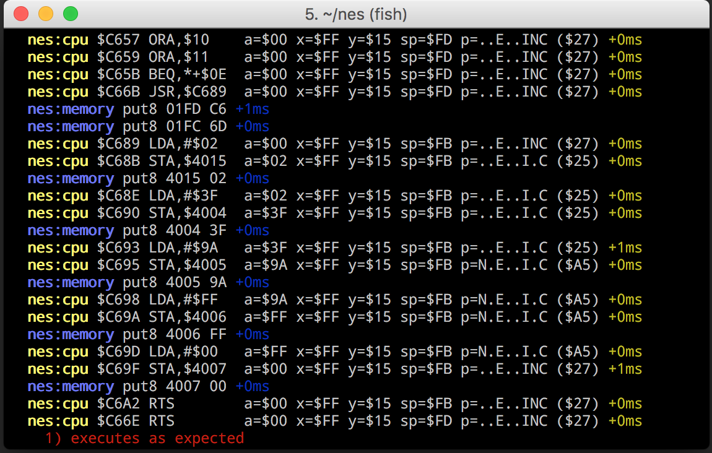

Introduction
============

This was a snowy winter cabin project with the goal of learning some things about 
the NES and the 6502.

The 6502 core is well unit tested, including an integration test that executes 
the rom file 'nesttest.rom' from nestdev.com. This rom is exeecuted 
by the test runner and each instruction's execution is compared against 
a log produced by another emulator known to have precise emulation.

Screenshot
==========

